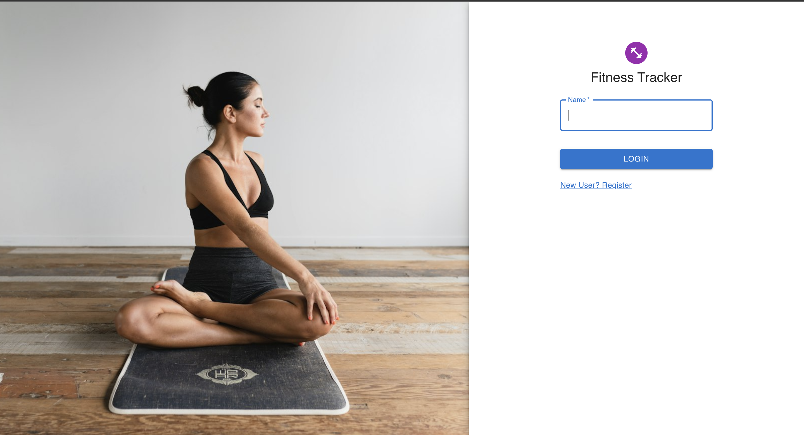
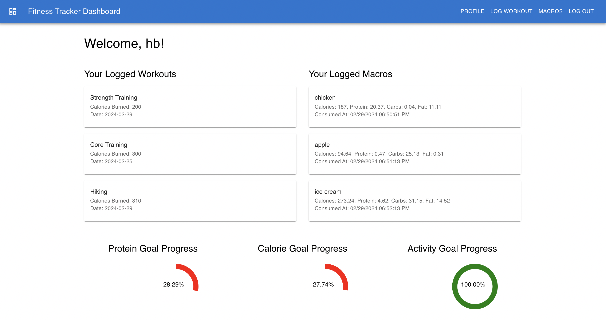
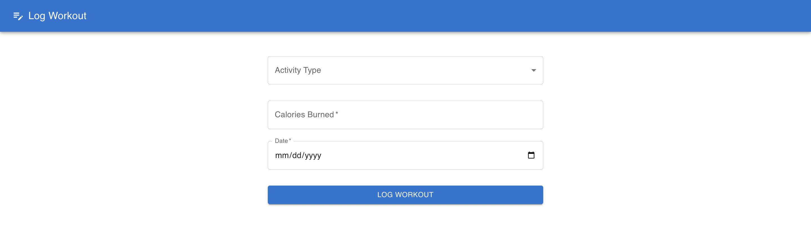
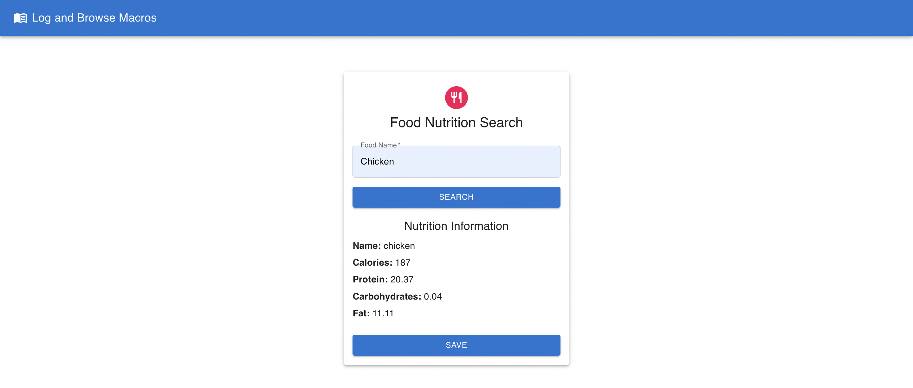
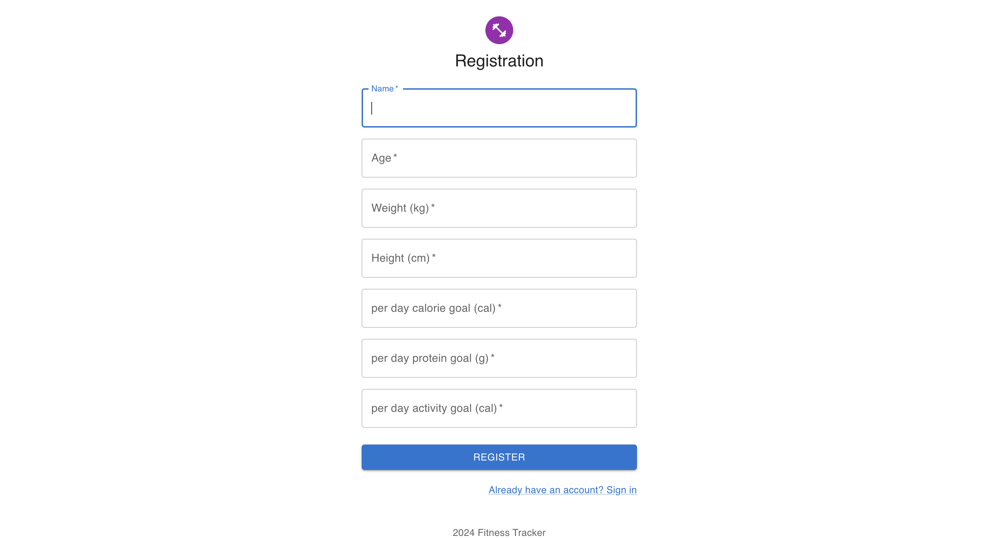
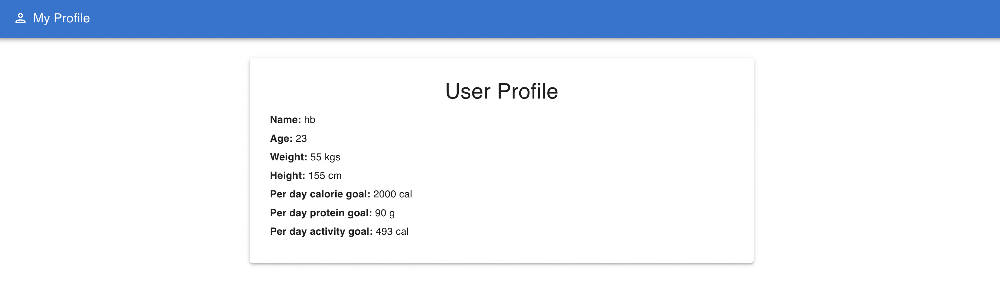

# Fitness Tracker

## Overview
This is a fitness tracker web application built using React. It allows users to log their workouts, track their daily macros (calories, protein, carbs, fat), and set goals for activity, calorie intake, and protein consumption.

## Features
- **User Authentication**:
  - Users can register with their name, age, weight, height, and set their daily goals.
  - Logging in requires entering the registered name.
- **Dashboard**:
  - Displays logged workouts and macros.
  - Shows progress towards daily protein, calorie, and activity goals.
- **Workout Logging**:
  - Users can log their workouts including activity type and calories burned.
- **Macro Logging**:
  - Users can search for foods to get nutrition information and log them.
- **Profile Page**:
  - Users can view and edit their profile information.
- **Responsive Design**:
  - The application is designed to work well on both desktop and mobile devices.

## Tech Stack
- **Frontend**:
  - React.js for building the user interface.
  - React Router for handling routing within the application.
  - Material-UI for styling components and UI elements.
- **Backend**:
  - Node.js and Express for the backend server.
  - MongoDB as the database to store user data, workouts, and macros.
- **APIs**:
  - [Nutritionix API](https://www.nutritionix.com/) for retrieving nutrition data of foods.
- **State Management**:
  - React Hooks (useState, useEffect) for managing component state.
- **Other Tools**:
  - Date-fns for date manipulation.
  - Axios for making HTTP requests.
  - ES6 JavaScript for modern syntax.

